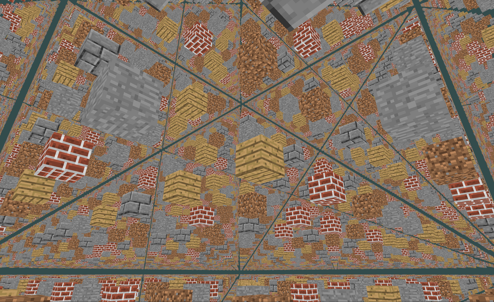
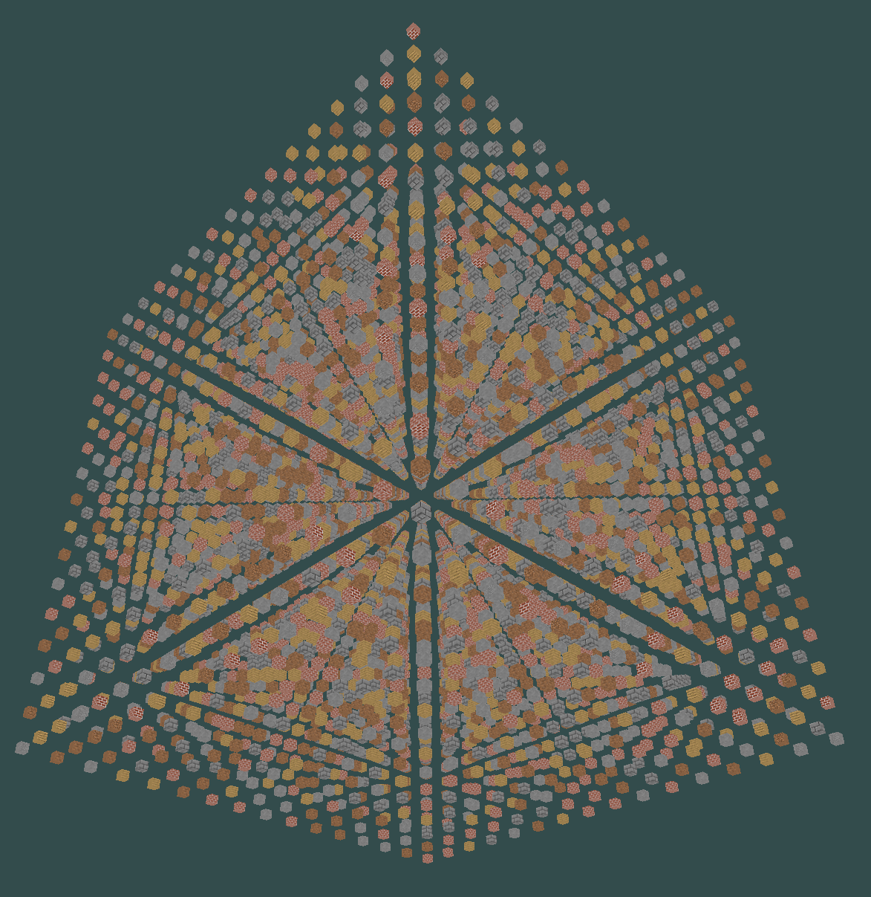

# Voxels
Voxels is a C++ voxel engine built with OpenGL and GLFW, designed for chunk-based rendering and efficient texture management. The project emphasizes clean architecture and ease of building, requiring no manual installation of dependencies.

# Features

- Chunk-based rendering for efficient voxel management.
- Autoloading of block textures with hashmaps for O(1) time lookup.
- OpenGL math done using the GLM library with matrices for transformations and rendering.
- Cross-platform build with CMake, works out-of-the-box.
- Culling of invisible faces between solid blocks.

# Build and Run
```bash
git clone https://github.com/petrustoica/Voxels
cd Voxels
cmake -S . -B build

cd build
cmake --build .
./voxels
```

# Screenshots

